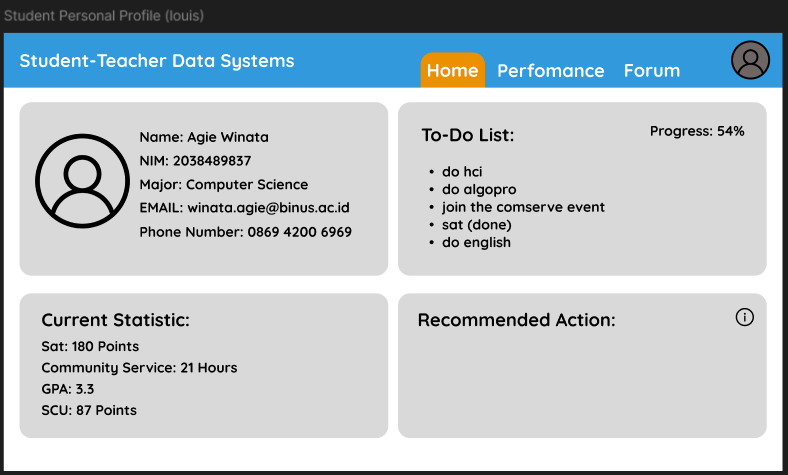
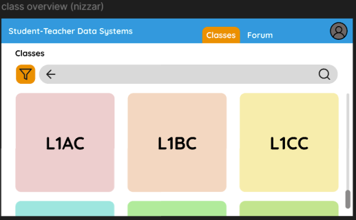
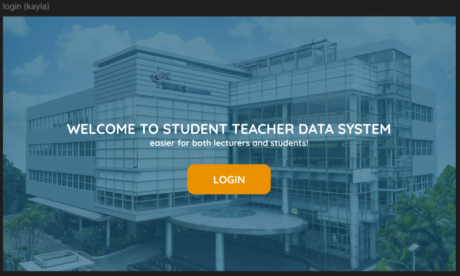
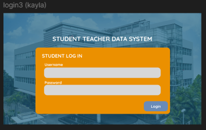
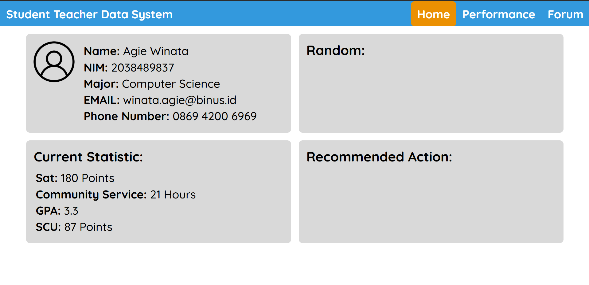
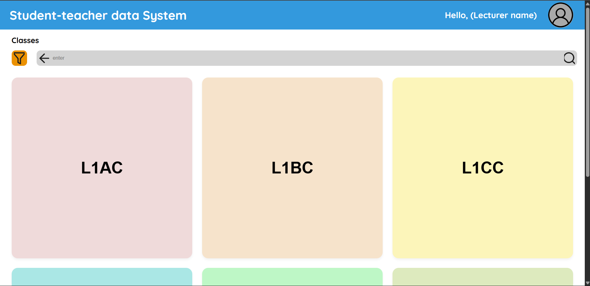

Louis Christian Dharma Panna Wibowo
2902731990

**Part A**
Original Pages:

Above is all the original pages that are designed by me and will be used for the final project. Inside these screenshots there a multitude of instances of requirements that are needed and gathered by from our target users.

Updated Pages: 

Above is all the original pages that have been updated with the design patterns in mind. Here we improve the design based on the 5 design patterns to improve user experience, some changes include a dedicated navigation bar or a clean and seperated layout and structure. These improvements are utilized to improve the user experience. Specifics will be discussed below for each updated page. 

**Part B**

**Design Pattern #1 - Navigation**

Before Page:  

Updated Page:

In the Final Project screenshot seen above, the design pattern of Navigation was utilized. This was utilized because it perfectly fits our feature needed in our final project. Since our final project was making a app/website for students and lecturers to see their own performance, forum, classes, and students, I implemented a navigation bar on top of the website to ensure students and or lecturers are able to navigate effectively within the website to travel between HTML screens in order to reach their desired information. This solves the problem of cognitive load. This solves it by remove the target audience's need to remember different paths to reach their desired path (example: having to traverse a specific page to reach another page). This will improve user improvement since users will easily be able to navigate easily on the top of the screen without having the need to remember the specific path to reach a specific screen. 

**Design Pattern #2 - Layout & Structure**
Before Page:  

Updated Page: 

In the Final Project screenshot seen above, the design pattern of layout and structure was utilized. This was utilized because it perfectly fits our feature needed in our final project. Our final project needed us to clearly seperate different classes for lecturers. This means that I needed a way to clearly indicate to the user that different buttons will lead to a different class depending on the seperation and the name on the buttons. Thus, resulting in a requirement for a clear layout and structure that tells the user clearly on the seperation of the content and improve its readability and understanding. This fixes the HCI problem of inefficiency and errors. By designing and utilizing an effective layout and structure that seperates the different classes in our final project, it mitigates the risk that users will accidentally make any mistakes in our application thus, leading to a more efficient solution. This will improve user experience since users will be least likely to make any mistakes that will hamper their experience while using the application. 

**Design Pattern #3 - Feedback & Status**
Before Page: 

Updated Page:

In the Final Project screenshot seen above, the design pattern of feedback and status was utilized. This was utilized because it perfectly fits our feature needed in our final project. Our final project needed a method to ensure that any input the user did was directly given a methodology to indicate that the input has been accepted and is processing. This solves the HCI problem of Feedback and performance. Since most users are generally impatient, they need an indication of if their input is being processed. By adding the login button in the login page, it ensured to the user than their input is slowly being processed for them. This improves the user experience by allowing them to know that their input is being validated and processed without the need to explicitly mention it whilst also providing ensurance. 

**Design Pattern #4 - Data Presentation**
Before Page:  

Updated Page:

In the Final Project screenshot seen above, the design pattern of data presentation was utilized. This was utilized because it perfectly fits our feature needed in our final project. Our final project is based on the ability for people to look at statistics and create an instant conclusion after viewing it. This is applicable to the student as well. The student needs the ability see their current statistics in terms of SATs, Community Service hours, GPA, and etc. By implementing our data presentation in the form of a list, the student is able to view the current statistics quickly and see what they need to improve upon. This improves the user experience by giving users the ability to view data quickly without the need of high amounts of jargon. Thus, leading to them efficiently accessing what they need.  

**Design Pattern #5 - Input & Forms**
Before Page: 

Updated Page: 

In the Final Project screenshot seen above, the design pattern of input and forms. This was utilized because it perfectly fits our feature needed in our final project. Our final project needed a way for the lecturers to easily find their class when they have the name in mind. This means that I had to implement a way for the user to input the class name and then the output will result in the desired class. This fixes the probblem of HCI inefficiency due to the ability to improve efficiency by minimizing the time it takes for the user to find their desired class when they can easily access the search bar and find it. This will improve user experience by giving them an easier means to access the search bar for any sort of narrowing output to improve efficiency. 

**Part C**
https://docs.google.com/document/d/1YvqHlBSVgRDa2DW_pM8QAWcn5qnjE206e-PI9KNrjik/edit?tab=t.0 

https://github.com/PuuPoo/HCI_Quiz2 
https://puupoo.github.io/HCI_Quiz2/

